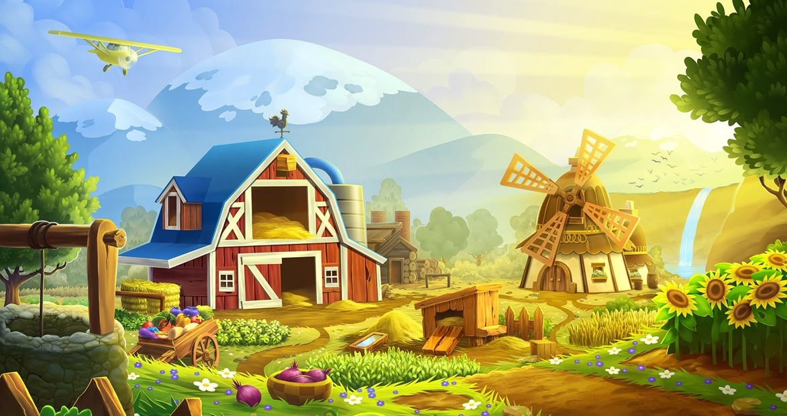

# 🌻 SUNNY WORLD - Farm Simulator



Đồ án môn học phát triển game - Game mô phỏng nông trại kết hợp yếu tố phiêu lưu, chiến đấu.

## 🎮 GIỚI THIỆU

**SUNNY WORLD** là tựa game mô phỏng nông trại được phát triển bằng ngôn ngữ C và thư viện Raylib. Người chơi sẽ vào vai một nông dân, xây dựng và phát triển trang trại của mình, trồng trọt, chăn nuôi, chiến đấu với quái vật và khám phá thế giới.

## ✨ TÍNH NĂNG NỔI BẬT

- 🌾 **Nông trại**: 11 loại cây trồng, mưa tự động tưới cây
- 🐄 **Chăn nuôi**: 3 loại vật nuôi (Gà, Lợn, Cừu)
- ⚔️ **Chiến đấu**: 3 loại quái vật, hệ thống Boss
- 👤 **Tài khoản**: 3 cấp độ PLAYER, TESTER, ADMIN
- 📋 **Nhiệm vụ & Thành tựu**: 5 nhiệm vụ, 16 thành tựu
- 🌦️ **Thời tiết**: Nắng, Mây, Mưa ảnh hưởng gameplay

## 🎮 CÁCH CHƠI

### Điều khiển
| Phím | Chức năng |
|------|-----------|
| **WASD** | Di chuyển |
| **Shift** | Chạy nhanh |
| **1-6** | Chọn công cụ |
| **I** | Mở túi đồ |
| **B** | Mở cửa hàng |
| **N** | Quản lý chuồng |
| **Q** | Xem nhiệm vụ |
| **F2** | Xem thành tựu |

## 💻 HƯỚNG DẪN CÀI ĐẶT

### Yêu cầu hệ thống
- Windows 10/11 (64-bit)
- 100 MB dung lượng trống
- 1 GB RAM
- OpenGL 3.3+

### Cài đặt nhanh
1. Tải game từ [Google Drive / GitHub Releases]
2. Giải nén và chạy `sunny_world.exe`

### Tự build từ source
```bash
# Clone repository
git clone https://github.com/hbui74727-pixel/OSG202_Project.git

# Cài đặt MinGW và Raylib
# Chạy lệnh build
mingw32-make build
mingw32-make run
```

## 📁 CẤU TRÚC THƯ MỤC
```
sunnyworld/
├── assets/     # Hình ảnh, font chữ
├── src/        # Mã nguồn
├── saves/      # Dữ liệu lưu game
└── logs/       # File log
```
## 🙏 CẢM ƠN
- Thư viện Raylib
- Cảm hứng từ Stardew Valley, Harvest Moon
- Giảng viên hướng dẫn
-access create : https://danieldiggle.itch.io/sunnyside

© 2026 Cóc Không Biết Code Team